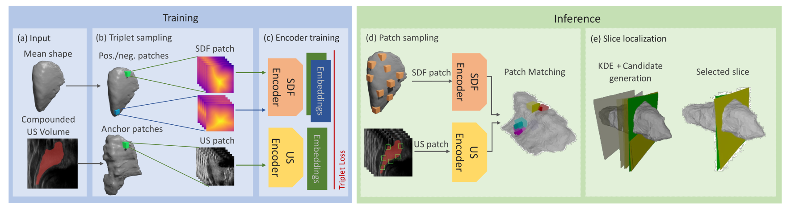

## On the Localization of Ultrasound Image Slices within Point Distribution Models [[Paper]](https://arxiv.org/abs/2309.00372)

**On the Localization of Ultrasound Image Slices within Point Distribution Models**<br>
Lennart Bastian*, Vincent Bürgin*, Ha Young Kim*, Alexander Baumann, Mahdi Saleh, Benjamin Busam, Nassir Navab<br>
In ShapeMI MICCAI, 2023.


---

Our framework for ultrasound(US) scan localization within a point distribution model(PDM). The input comprises US data and a 3D shape model (a). Anchor, positive, and negative patches are sampled from US and SDF modalities (b), after which we learn a joint embedding across modalities with a triplet loss (c). During inference, sampled patches are encoded and matched based on their similarity in the embedding space (d). We employ Kernel Density Estimation (KDE) and an iterative refinement to localize the position of a candidate slice on the 3D shape model (e).

---


### Install
This implementation uses Python 3.8, PyTorch 2.0 and Cuda 11.8. We recommend to use [conda](https://docs.conda.io/en/latest/miniconda.html) to deploy the environment.
  * Create environment with conda:
  ```
  conda create -n your_env python=3.8
  conda activate your_env
  ```
  * Install the basic framework (Cuda, PyTorch, NumPy):
  ```
  conda install -c "nvidia/label/cuda-11.8.0" cuda-toolkit
  export PATH=~/miniconda3/envs/s3m/bin:{$PATH}
  export LD_LIBRARY_PATH=~/miniconda3/envs/s3m/lib:${LD_LIBRARY_PATH}
  pip install numpy==1.23.5
  pip install -i https://download.pytorch.org/whl/cu118 torch==2.0.0 
  ```
  * Install the other packages:
  ```
  pip install -r requirements.txt

  ```

### Data Structure
The model requires meshes as input data of 
- US scan with format NIfTI (e.g. .nii) 
  - which contains original scan 
  - and the segmentation (label) of the organ
- 3D point cloud of organ mesh or statistical shape model with format ply

The files must be enumerated in the following way:<br>    
```
data
   |-- 000.nii' # scan data
   |-- 001.nii' # scan data
   |-- 002.nii' # scan data
   ...
   |-- 000-labels.nii'  # label of the scan
   |-- 001-labels.nii'  # label of the scan
   |-- 002-labels.nii'  # label of the scan
   ...
   |-- 001.ply
   |-- 002.ply
   |-- 003.ply
   ...
   
```


### Run the pipeline
After setting configurations, run the code ` pipeline/train_2d3d.py ` for encoder training then ` pipeline/kde_eval.py ` for slice matching.


The final results is shown as below.


---
 

---


### Citation
If you find our work helpful, please consider citing

```
@article{bastian2023localization, 
      title={On the Localization of Ultrasound Image Slices within Point Distribution Models}, 
      author={Lennart Bastian, Vincent Bürgin, Ha Young Kim, Alexander Baumann, Benjamin Busam, Mahdi Saleh, Nassir Navab},
      year={2023},
      eprint={2309.00372},
      archivePrefix={arXiv},
      primaryClass={eess.IV}
}
```
